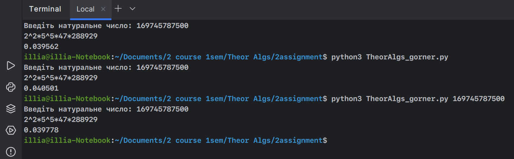
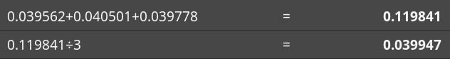
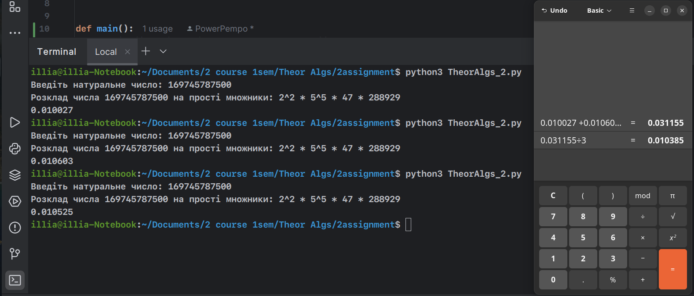

# Програма для розкладання натурального числа на прості дільники


## Спосіб роботи
1. Словник 'factors' є важливою частиною програми, який за мірою прогресу доповнюється всіма дільниками
```python
factors = {}
```
2. Основою програми є цикл 'While', за яким слідує цикл 'For'. 
Вони своєю чергою виконують головні обчислення програми, дані з них в кінці додаються до словника "Factors" та через "join" виводяться напряму зі словаря
```python
while n % 2 == 0:
    if 2 in factors:
        factors[2] += 1
    else:
        factors[2] = 1
    n = n // 2
```

## Программа за методом Горнера

Виконує такий самий функціонал, але більш наближена до умов мови С++, та не використовує словник, як тип даних.


# Експеримент

Щоб дізнатись який з методів швидший я зробив невеликий експеремент.
Маючі дві програми, які виконують одні й ті самі дії, але різними способами я поставив метрики через основну біблеотеку виміру часу виконанная скриптів "time".

## Важливе примічання.
Ці виміри є суто моїм експериментом, та я не продвигаю НІЯКІ теорії, через вірогідні "не справедливі умови".
Я був зацікавлений методом Горнера, та мав бажання подивитись, наскільки метод горнера є ефективним саме в таких умовах.
Цей вимір нічого не показує, окрім порівняння програми, в якій я користуюсь бібліотекою 'math' та одразу ініціалізую словник, в якому подалі зберігаються дані відповіді.
З іншого боку В нас є програма з точно таким самим візуальним результатом, але в якій використовується метод "Горнера", як основа.


## Хід експерименту 
Провівши експеримент я підтвердив свої догадки та зробивши по три запуски програм з абслютно однаковими вхідними числами отримав такі результати.
Для кожного експерименту я брав багатосоставне число з великих степенів простих чисел, цим числом виступило : 
```python
n = 169745787500
```


## Результат програми метода Горнера




# Результат програми методом оптимізованим методом пробного ділення


