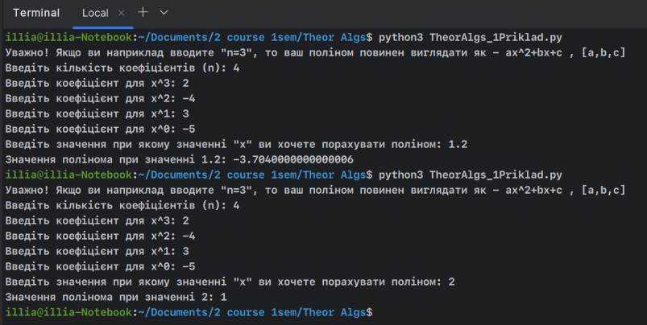

# Программа для вычисления значения полинома

## Инструкция
Внимание! Программа считает только полиномы. 
Если мы желаем посчитать такой пример: `P(x)=2x^3 − 4x^2 + 3x − 5`

1. Введите количество всех элементов в полиноме. В нашем случае - 4:
    ```bash
    Введіть кількість коефіцієнтів (n): 4
    ```

2. Затем вас попросят ввести коэффициенты всех элементов. В нашем случае мы вводим:

   

3. В зависимости от введённых данных получите свой результат.


